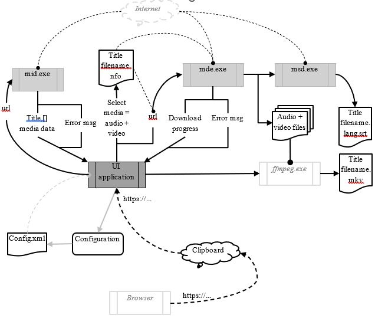

# Medalorg

## Proof Of Concept

The medalorg-POC is the proof of concept to acquire the technology, the experience and information implementing such a solution.

The code is *'dirty'* and the POC hos no other purpose than to experience how it works.

The information is:
1. The best way to extract the audio and video would be using *WebResponse* then access and reading the stream.
2. The maximum buffer transmitted in a *read()* is of maximum 16,384 bytes.
3. When a video is not in high demand, it is stored on the back up servers. It is possible to access the data but as the access is not prioritized by the server we will receive now and then either a *timeout* or an *unexpected EOF*. 
   The solution is to wait a few seconds and to restart the process. I am still puzzled about the *protocol error* message. 
  My take is that the audio or video access request is cancelled by the server as the media is maybe located on a remote backup server and need to be brought back to *life* - all I know is that after a few hours, I can then start to download the media.
4. For each media, we can download in parallel the audio, the video and the subtitles.
5. Some alternative to download using *Google* or some examples from *libvideo* expect you to create a cookie of the form as shown below. I personally do not like and mistrust any cookies
	...
    new Cookie( "CONSENT", "YES+cb", "/", "youtube.com" )
	...

### Engine
#### *Phase I*
**Goal**: Extracting the external logic and make it run.
The engine is generating 2 important files: an audio mp3 file of the best quality available and a mpeg file of the best quality capped to 1080 (config default).
facts:
1. When downloading a *mp3* or a *mpeg* file asynchronous events like closing the application may prevent the file for being totally downloaded. Similarly, after 6 attempts or a protocol error, the download attempts will stop to be resumed later on.
2. Both these files must exist and be correctly downloaded for the *ffmpeg.exe* to process and merge these two creating an *.mp4* file.
3. The existence of a *mp3* or an *mpeg* files does not mean the download is completed and successful.
#### *Phase II (initial commit 2)*
**Goal**: Improve the core engine and confirming all files are downloaded
1. Once the sequence is processed, some file(s) may not be downloaded, an external loop will reparse each item in the list until all the processed items are completely downloaded.
2. The similar logic will be implemented for the playlist, to the exception that a playlist may not be fully downloaded because some videos have been removed. To prevent infinite loop, the list download engine must receive from the download process confirmation the video is present or not. If the video is not present, the video will simply be return true (in the POC code it is the *static bool Download( string url )*) to indicate that the process is completed. 
#### *Phase III (improve code)*
**Goal**: Investigate the merging tool and how to use it.
1. In case of error, it appears *ffmpeg.exe* does not return an error code even with the argument *-max_error_rate 0.0*, therefore before launching the merge, we will need to not only verify if the file exists but also if its length corresponds to the content length. In that case if *ffmpeg.exe* returns an error, there is nothing we can do.
2. If a *mpeg* file and an *mp4* exist, then something wrong happened, and we will restart it all deleting all instance of the media.
3. **Possible solution**: once the mpeg file is completely downloaded, a file with the name of the video and the extension *.nfo* will contain the resolution and file length of the *mpeg*, the bitrate audio and file length of the *mp3*, the hash of the audio. Before downloading, the logic will first check if the *nfo* file exist, the engine will confirm the length of the mpeg and the length of the audio with both the file and the data retrieved.
4. **Parallel processing constraint**: In order to parallelize efficiently, we will add in a list all video and audio we want to download, then create threads and download in each threads the audio and or video. the thread of the video will wait for the audio to be fully downloaded before initiating the merge calling *ffmpeg.exe*
#### *Phase IV*
**Goal**: Integrate the logic of possible multiple async requests and prepare for a threaded object-oriented solution.
1. The best alternative is to store the data in a *MemoryStream* object and flush the object only if fully downloaded. Therefore upon a fully donwloaded media, we will have an *.aac/*.ogg/*.opus* and an *.mpeg* file completed (the preferred audio and video format is configurable - default *.ogg* and *.mp4*. 
2. It appears that due to the activity on the you tube server we are connecting, we may receive a protocol error - cancel the operation that will be resumed later on.
3. When receiving an EOF, timeout or pending, we simply increase the web timeout and *Sleep()*

**Goal**: discover and test the best and most reliable API fuctionalities to access the audio and mpeg file.
1. the community recommend to use the *HttpClient()* and calling the *await client.GetAsync()* to access the response and then get the stream. Using such method prevent me to access the data: 90% of the files received a 403 forbidden to download or a cancellation in the middle of the task. Is there a reason for it? Certainly, but I do not want to investigate: such way is not reliable for my solution.
2. The main issue with the *WebRequest.Create()* is that the local endpoint is not immediately released and that will always end up in a *WebExceptionStatus.ProtocolError*. To resolve the 'bad design' issue from the .Net library simply set the following:
  w_request.ServicePoint.MaxIdleTime = 1000;
  w_request.KeepAlive = false;
  The *MaxIdleTime* will maintain the used connection alive 1 second and the *KeepAlive* will prevent to reuse
3. Extract a specific function that is downloading from a Stream. The function uses a *TemporaryFile Disposable* object to store the stream in (cfr https://stackoverflow.com/questions/20146/how-to-create-a-temporary-file-for-writing-to-in-c). Once the stream is locally transferred, the file is then renamed to the title of the video with either an audio or video extension. This ensure that a file on the support is fully downloaded making sure the merging process will be successful.
4. Release of the heap memory allocation. In order to release the heap and maintain the application light we will proceed to 2 different types of garbage collection:
    - after each download
	  GC.Collect();
      GC.WaitForPendingFinalizers();
      GC.Collect();
	- a forced one after the merge
	  GC.Collect(GC.MaxGeneration, GCCollectionMode.Forced);
### POC conclusion
1. .Net has a poor network memory management - whatever I do, I always end up with a *WebExceptionStatus.ProtocolError*. The solution would be to execute the launch the download engine as an external application and automatically restart the engine after a *WebExceptionStatus.ProtocolError*. 
   **Solution**: implement the download engine in an external console application that can be executed. The arguments will be a file containing a list in an xml format of the media to download. the output and error channel will be uswd by the console application to either report an error or the progress on the standard output channel.
2. In order to implement such solution, we need to reduce/eliminate the dependency of the *YouTubeVideo* object. We are using
	- the category (audio or video)
	- the type (aac, vorbis, opus, mp4 or webm)
	- the length of the data to download
	- the uri
	- the title of the media
3. Create a **IMediaData** interface representing the processing of either a audio, video, merge or subtitle. The interafce will be applied on the *MediaAudio*, *MediaVideo*, *MediaMerge* and *MediaSubtitle* objects. Serialize the objects.
    - Create one executable depending on *libvideo* to extract the media information and serialize these.
    - Create an executable downloading the subtitles and depending on *Google.Apis*.
	The solution allows us to stress and implement standalone solutions while solving our *WebExceptionStatus.ProtocolError* as each application instance will be tasked to download only one media (audio, video).
## Modules
### Media Download Engine
As a result of the memory management and the web network connection ending up as a protocol error. The engine is an executable where the argument specifies the media to download and where to store the downloaded file. The console application output and error will be redirected to a callback of the caller.
### Media Subtitle Download
The download process is in a separate executable because depending of Google.Api module. The arguments will precise the url as well as the subtitle language and the destination path.
### Media Info Download
Using the external libvideo library, download all the video and audio information: type of media (aac, vorbis, opus, mp4 or webm), the data length, the title, the uri, …
### ‘ffmpeg.exe’
External application that is merging an audio file with a mpeg file in order to produce a video media file.
## Flow

## Technical Analysis
### Configuration
**Default selections**
The end-user also default selects the format and resolution of the media as well as the number of concurrent downloads.
**Media root target directory**
For each type the end-user can specify a target directory where the media audio and/or video will be generated.
**Category as sub-directory**
The end-user lists the type of media like jazz, blues, rock, … but also informatic, physics, news, etc.…
Author as sub-directory
Most of the time the title of the media starts with the name of song or group followed by a separator like ‘-‘, ‘:’ or ‘,’. The configuration offers to store the media in the sub directory of the name of the singer or group.
Alternatively, the end user may select to include the author name.in the media pathname.
### mid.exe
**Input**: a list of video ID
**Output**: for each video extracted a csv in the output stream or an error if the video is not available. Note that if a video from a list is not available, the output will simply be omitted.
The format is as follows:
> title , author , nr-media-data
> type , format , resolution , length
where:
> title = the string identifying the media
> author = web ID of the person/organization posting the media
> type = audio | video
> format = acc | vorbis | opus | mp4 | webm
> resolution = audio-bit-rate | video-pixel-resolution
### mde.exe
The argument of the executable is composed of the full pathname of the nfo file containing the information to download and store the downloaded data.
The subtitles, if requested, will be generated upon successful download of the media. The subtitles will be converted to lyrics (.lrc) in the audio directory and .srt in the video directory.
### msd.exe
The application will extract the lyrics for audio files and/or subtitles for video files. 
The input arguments are:
> url  language-code  -s *subtitle-filename* -l *lyrics-filename*
### ffmpeg.exe
The application will be executed only if the audio and video download are successful. The argument provided are 
> -v 0 -y -max_error_rate 0.0 -i audio-file -i video-file -preset veryfast *video-media-file.mp4*
### user interface
**Starting**
Upon startup, the application initiates a refresh: it loads from the database all the downloaded information and displays only the media yet to be downloaded.
**Requests**
The application monitors the clipboard and selects every valid http address. Once a web address is recognized as valid, the application executes the mid.exe and if the output data correspond to a media, adds the new media to the list view with the date and time stanps.
**Download criteria**
Once the end user selects a media to be downloaded, the right panel displays the formats, resolution, subtitle language (if available), bit rate and also confirms the destination pathname(s). After selecting the parameters and confirming the destination, the user can then initiate the download process.
**Downloading**
After displaying the alternative to download from the mid.exe, once the user selects the audio and/or video to download, the application generates a <id>.nfo file in the application database directory for each media to download before calling the mde.exe.
The nfo file format is an xml file list the media information to download and the full pathname to store the downloaded data.

